# Azure AKS Microservice Architecture

**Cloud Infrastructure Project Documentation**
Infrastructure as Code · Kubernetes · CI/CD with OpenID Connect

Prepared by Noel Gens · August 2026

---

## Contents

1. [Executive Summary](#1-executive-summary)
2. [Architecture Overview](#2-architecture-overview)
3. [Technology Stack](#3-technology-stack)
4. [Infrastructure as Code (Terraform)](#4-infrastructure-as-code-terraform)
5. [Secretless CI/CD: GitHub Actions via OIDC](#5-secretless-cicd-github-actions-via-oidc)
6. [Kubernetes Deployment](#6-kubernetes-deployment)
7. [Incident: Diagnosing a Failed Image Pull](#7-incident-diagnosing-a-failed-image-pull)
8. [Exposing the Application](#8-exposing-the-application)
9. [Security Considerations](#9-security-considerations)
10. [Skills Demonstrated](#10-skills-demonstrated)
11. [Resume Bullet Points](#11-resume-bullet-points)
12. [Appendix: Repository Structure](#appendix-repository-structure)

---

## 1. Executive Summary

This project provisions a production-style Kubernetes environment on Microsoft Azure using fully automated, auditable tooling: Terraform for infrastructure provisioning, Azure Kubernetes Service (AKS) as the container orchestration platform, and GitHub Actions with OpenID Connect (OIDC) federation for secretless CI/CD deployment. Beyond standing up the environment, this document captures a real production-style incident — a failed container image pull — diagnosed and resolved using standard Kubernetes troubleshooting workflows, with the evidence trail included below.

The goal of this build was to demonstrate, hands-on, the core competencies expected of a Cloud / Solutions Engineer: infrastructure-as-code discipline, container orchestration, secure CI/CD identity federation, network design, and methodical incident diagnosis.

**Key Outcomes**

- Provisioned a resource group, virtual network, subnet, and AKS cluster entirely via Terraform — no manual portal configuration.
- Configured passwordless, secretless CI/CD authentication from GitHub Actions to Azure using Microsoft Entra ID Workload Identity Federation (OIDC).
- Diagnosed and resolved a Kubernetes service CIDR / VNet address space conflict during cluster creation.
- Deployed a two-replica NGINX workload and exposed it to the public internet via a Kubernetes LoadBalancer Service.
- Reproduced, diagnosed, and root-caused a live ErrImagePull / ImagePullBackOff incident using `kubectl describe` and Events analysis.
- Documented the full build with verifiable, timestamped command-line and Azure Portal evidence.

---

## 2. Architecture Overview

The environment consists of an Azure Virtual Network hosting a dedicated AKS subnet, an AKS cluster with a two-node Linux node pool, and a Kubernetes Deployment exposed externally through a LoadBalancer Service.

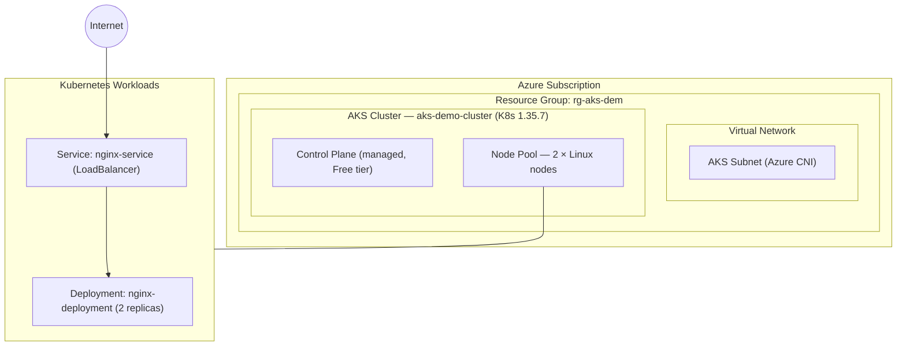

*Figure 1. Logical architecture of the deployed environment.*

Traffic reaches the application via: **Internet → Azure Load Balancer** (public IP, auto-provisioned by the LoadBalancer Service) **→ kube-proxy → pod**, selected using the `app: nginx` label selector.

---

## 3. Technology Stack

| Category | Detail |
|---|---|
| Cloud Provider | Microsoft Azure |
| Infrastructure as Code | Terraform (azurerm provider ~> 3.90) |
| Container Orchestration | Azure Kubernetes Service (AKS), Kubernetes 1.35.7 |
| Networking | Azure Virtual Network, Azure CNI, custom service CIDR |
| CI/CD | GitHub Actions |
| Identity / Auth | Microsoft Entra ID Workload Identity Federation (OIDC) — no static secrets |
| State Management | Terraform remote state — Azure Blob Storage backend |
| Container Runtime | containerd (via AKS) |
| Workload | NGINX (2 replicas, resource requests/limits defined) |

---

## 4. Infrastructure as Code (Terraform)

All Azure infrastructure was defined declaratively in Terraform rather than created manually through the Azure Portal, ensuring the environment is reproducible, version-controlled, and auditable.

### 4.1 Resources Provisioned

- `azurerm_resource_group` — `rg-aks-dem`
- `azurerm_virtual_network` + `azurerm_subnet` — dedicated AKS subnet
- `azurerm_kubernetes_cluster` — system-assigned managed identity, Azure CNI networking, 2-node Linux pool

### 4.2 Incident: Service CIDR / VNet Overlap

During the first `terraform apply`, cluster creation failed with a 400 Bad Request from the Azure API:

```
Error: creating Kubernetes Cluster: unexpected status 400 (400 Bad Request)
"code": "ServiceCidrOverlapExistingSubnetsCidr"
"message": "The specified service CIDR 10.0.0.0/16 is conflicted
  with an existing subnet CIDR 10.0.1.0/24."
```

**Root cause:** AKS defaults its internal Kubernetes service network to `10.0.0.0/16`, which overlapped with the VNet's own `10.0.0.0/16` address space (containing the `10.0.1.0/24` AKS subnet). Because Azure CNI assigns pods real routable IPs from the VNet, the cluster-internal service network and the VNet network must occupy non-overlapping address ranges.

**Resolution:** explicitly set a disjoint service CIDR in the cluster's `network_profile` block:

```hcl
network_profile {
  network_plugin    = "azure"
  load_balancer_sku = "standard"
  service_cidr      = "172.16.0.0/16"
  dns_service_ip    = "172.16.0.10"
}
```

This is a genuine, non-trivial networking decision that mirrors real-world AKS design work — not a default left untouched.

---

## 5. Secretless CI/CD: GitHub Actions via OIDC

Rather than storing long-lived Azure credentials as GitHub Secrets, the pipeline authenticates using Microsoft Entra ID Workload Identity Federation. GitHub issues a short-lived OIDC token for each workflow run; Azure exchanges that token for access, scoped to a specific repository and branch — with no client secret ever stored.

### 5.1 Identity Setup

- Created a Microsoft Entra ID App Registration and Service Principal (`az ad app create` / `az ad sp create`).
- Granted the Service Principal a Contributor role assignment scoped to the subscription.
- Configured a federated identity credential trusting GitHub's OIDC issuer (`token.actions.githubusercontent.com`), scoped to a specific subject claim.

### 5.2 Incident: Subject Claim Mismatch (AADSTS70025)

The first deployment attempt failed authentication with `AADSTS70025` — "no configured federated identity credentials." Inspecting the actual `azure/login` log output revealed GitHub was sending an immutable-ID subject claim format rather than the plain org/repo form assumed when the federated credential was first created:

```
Expected : repo:noeleon21/Azure-AKS-microservice-architecture:ref:refs/heads/main
Actual   : repo:noeleon21@125841793/Azure-AKS-microservice-architecture@1343462545:ref:refs/heads/main
```

Azure performs an exact string match on the subject claim — no wildcards are supported — so this mismatch caused a hard authentication failure despite an otherwise correct configuration. The fix was to register a federated credential using the exact subject string observed in the live token, confirmed by reading the workflow's own log output rather than assuming documentation defaults.

### 5.3 Workflow Configuration

```yaml
permissions:
  id-token: write
  contents: read

env:
  ARM_CLIENT_ID: ${{ vars.AZURE_CLIENT_ID }}
  ARM_SUBSCRIPTION_ID: ${{ vars.AZURE_SUBSCRIPTION_ID }}
  ARM_TENANT_ID: ${{ vars.AZURE_TENANT_ID }}
  ARM_USE_OIDC: true
```

The `azurerm` Terraform backend and provider both authenticate via these `ARM_*` environment variables using `use_oidc = true`, independent of the `az` CLI's own login state — an important distinction that shaped how the workflow and backend block were configured.

---

## 6. Kubernetes Deployment

With the cluster provisioned, `kubectl` was connected using Azure AD-integrated credentials, and the workload was deployed declaratively.

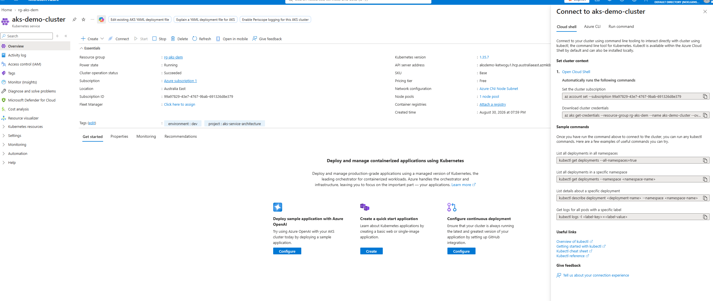
*Figure 2. AKS cluster overview in the Azure Portal — rg-aks-dem, Kubernetes 1.35.7, Australia East, Azure CNI networking, 1 node pool.*

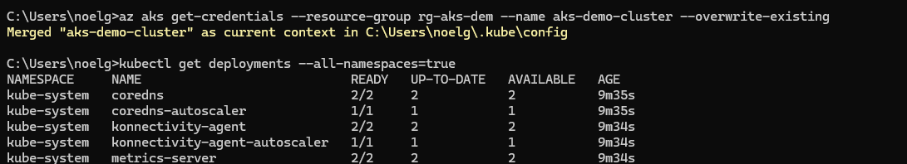
*Figure 3. Connecting kubectl to the cluster and listing system deployments across all namespaces.*

### 6.1 Deployment Manifest

```yaml
apiVersion: apps/v1
kind: Deployment
metadata:
  name: nginx-deployment
  labels:
    app: nginx
spec:
  replicas: 2
  selector:
    matchLabels:
      app: nginx
  template:
    metadata:
      labels:
        app: nginx
    spec:
      containers:
        - name: nginx
          image: nginx:latest
          ports:
            - containerPort: 80
          resources:
            requests:
              cpu: "100m"
              memory: "128Mi"
            limits:
              cpu: "250m"
              memory: "256Mi"
```

### 6.2 Service Manifest

```yaml
apiVersion: v1
kind: Service
metadata:
  name: nginx-service
spec:
  type: LoadBalancer
  selector:
    app: nginx
  ports:
    - protocol: TCP
      port: 80
      targetPort: 80
```

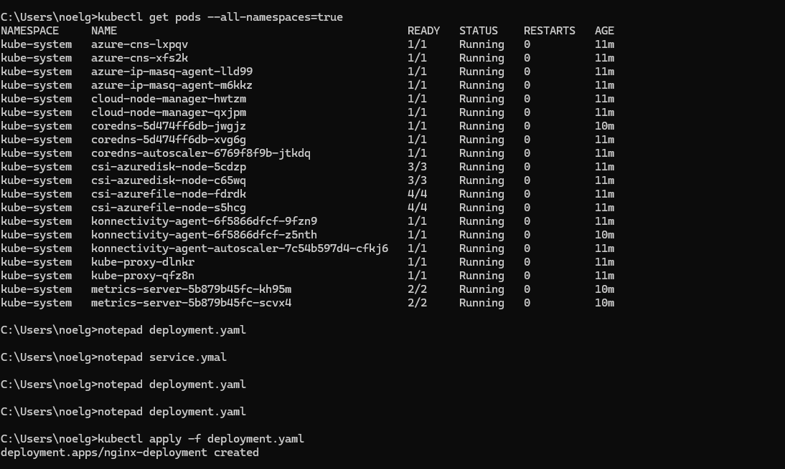
*Figure 4. System pods running across kube-system, followed by kubectl apply successfully creating nginx-deployment.*

---

## 7. Incident: Diagnosing a Failed Image Pull

Shortly after the initial rollout, a routine deployment update surfaced a real failure — an invalid image tag was applied, producing a pod stuck in a pull-failure state. This section documents the live diagnostic process used to identify and resolve it, using only kubectl's built-in troubleshooting commands.

### 7.1 Symptom

`kubectl get pods` showed one of the three replicas failing to start, cycling between `ErrImagePull` and `ImagePullBackOff`, while the other two replicas continued running — illustrating Kubernetes' rolling update behavior protecting availability during a bad rollout:

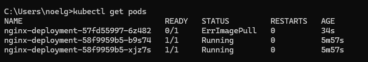
*Figure 5. New pod stuck in ErrImagePull immediately after rollout, while existing replicas remain Running.*

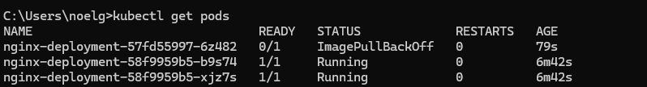
*Figure 6. State transitions to ImagePullBackOff as Kubernetes retries with exponential backoff.*

### 7.2 Root Cause Analysis

Running `kubectl describe pod` against the failing pod exposed the precise cause in the Events section at the bottom of the output — the image tag `nginx:latest2` does not exist in the registry:

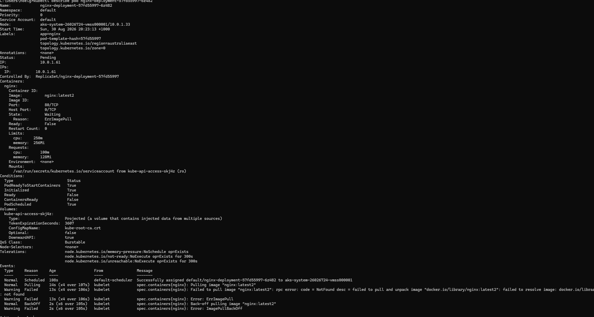
*Figure 7. Full kubectl describe pod output: container state Waiting, Reason: ErrImagePull, image nginx:latest2.*

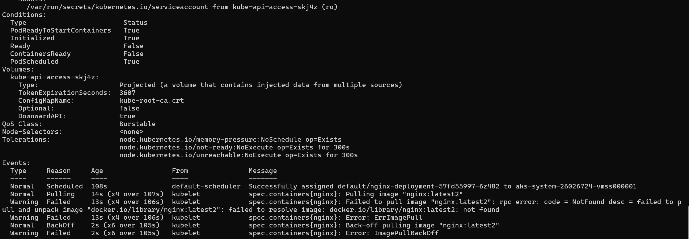
*Figure 8. Events section confirming the exact failure: "failed to resolve image docker.io/library/nginx:latest2: not found."*

### 7.3 Resolution

The image tag was corrected back to `nginx:latest` and re-applied. Kubernetes' rolling update strategy replaced the failed pod automatically once the corrected manifest was applied, with **zero downtime** to the application — the two healthy replicas served traffic throughout the entire incident.

### 7.4 Diagnostic Method (for reference)

1. `kubectl get pods` — identify which pod(s) are unhealthy and their current state.
2. `kubectl describe pod <name>` — inspect the Events section for the specific failure reason and message.
3. `kubectl logs <name>` — confirmed empty here, correctly indicating the container never started (a pull failure, not an application crash).
4. Correct the manifest and `kubectl apply` again — Kubernetes reconciles automatically.

---

## 8. Exposing the Application

The `nginx-service` LoadBalancer Service triggered Azure to provision a public IP and Azure Load Balancer automatically:

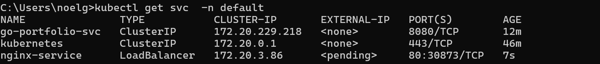
*Figure 9. nginx-service in a pending state immediately after creation — EXTERNAL-IP still provisioning.*

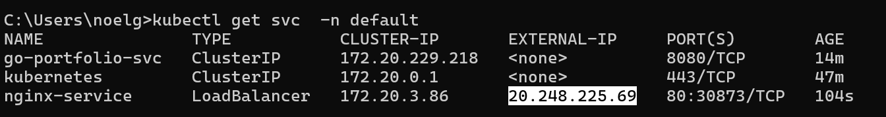
*Figure 10. EXTERNAL-IP resolved to a public address (20.248.225.69) within approximately two minutes.*

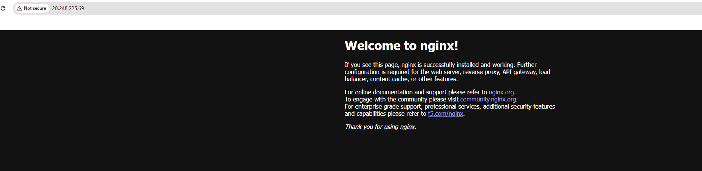
*Figure 11. The application confirmed reachable from the public internet at http://20.248.225.69.*

---

## 9. Security Considerations

- No static Azure credentials stored anywhere — CI/CD authenticates via short-lived OIDC tokens scoped to a specific repository and branch.
- Terraform state stored remotely in Azure Blob Storage with public blob access disabled and versioning enabled, rather than on a local disk or in source control.
- Service principal role assignments scoped as narrowly as practical for the task (with a documented note that production use should scope `Storage Blob Data Contributor` to the state storage account specifically, rather than `Contributor` at the subscription level used for this demo).
- AKS cluster identity uses a system-assigned managed identity rather than embedded credentials.
- Resource requests and limits defined on all containers to prevent noisy-neighbour resource exhaustion.

---

## 10. Skills Demonstrated

- **Infrastructure as Code:** Terraform authoring, state management, and remote backend configuration.
- **Kubernetes:** Deployments, Services, label selectors, rolling updates, and resource management.
- **Cloud networking:** VNet/subnet design, CIDR planning, and diagnosing address space conflicts.
- **CI/CD security:** OIDC / Workload Identity Federation, eliminating static secrets from a deployment pipeline.
- **Production-style incident response:** reproducing, diagnosing via structured log/event analysis, and resolving a live failure.
- **Technical documentation:** capturing infrastructure decisions and incidents with verifiable evidence.

---

## 11. Resume Bullet Points

Ready-to-use phrasing distilled from this project:

- Provisioned an Azure Kubernetes Service (AKS) environment end-to-end using Terraform, including VNet/subnet design and resolution of a Kubernetes service CIDR conflict with the underlying VNet address space.
- Implemented secretless CI/CD authentication from GitHub Actions to Azure using Microsoft Entra ID Workload Identity Federation (OIDC), debugging an immutable-ID subject claim mismatch via live token inspection.
- Diagnosed and resolved a production-style ImagePullBackOff incident on a live Kubernetes deployment using kubectl describe and Events analysis, with zero application downtime due to rolling update design.
- Configured remote Terraform state storage on Azure Blob Storage with private access and versioning, decoupled from the infrastructure it manages.

---

## Appendix: Repository Structure

```
azure-aks-project/
├── main.tf
├── variables.tf
├── outputs.tf
├── providers.tf          # azurerm backend, OIDC-authenticated
├── terraform.tfvars
├── kubernetes/
│   ├── deployment.yaml
│   └── service.yaml
├── .github/workflows/
│   └── deploy.yml
├── docs/
│   └── images/
└── README.md
```